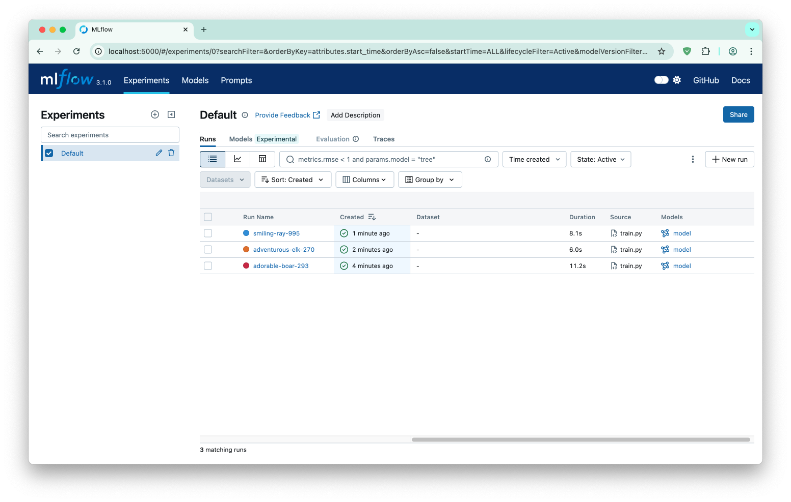
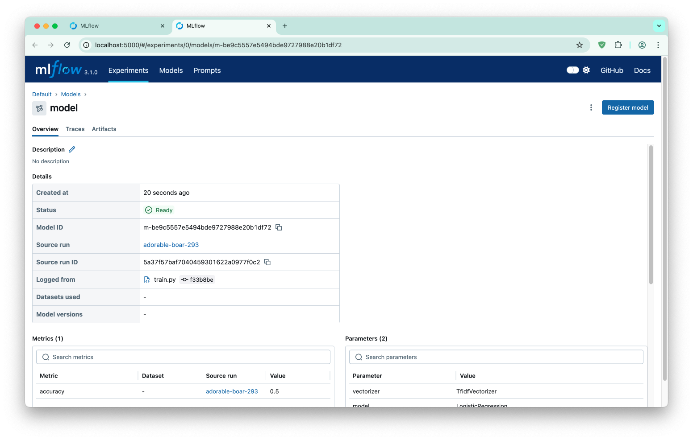

# toxic-comment-classification-mlflow-demo

## MLFlow demo

### Start MLFlow

```sh
python3 -m venv venv
source venv/bin/activate

pip install --upgrade pip
pip install -r requirements.txt

mlflow ui
```

### Train (with different data)

***comments_10 -> comments_100 -> comments_500000***

```sh
vim train.py
```

```sh
source venv/bin/activate
export MLFLOW_TRACKING_URI=http://localhost:5000
python3 train.py
```

### Serve (with different version of model)

```sh
vim serve.py
```

```sh

source venv/bin/activate
uvicorn serve:app --reload
```

### Classify comment

```sh
curl -X POST http://localhost:8000/predict \
  -H "Content-Type: application/json" \
  -d '{"text": "I like it"}'
```

### Demo



